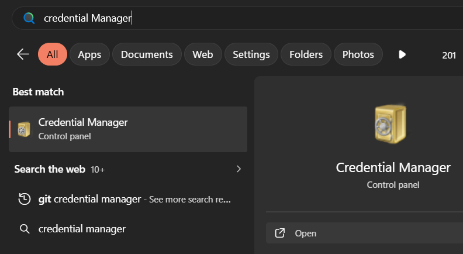
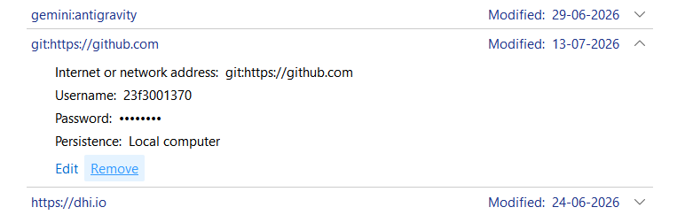

if shifting from one account to anothre account, then go the credentials manager and delete the credentials of the old account.

After opening go to windows Credentials and delete the credentials of the old account.

then find git credentials and delete it.

---
---

🔓 Public Repositories (Anyone can see and copy)

If you create a **Public** repository, your code is published to the open internet.  Stack Overflow

-   **Other developers** can view, download, clone, and copy your code. If your idea is completely out in the open, someone else could easily copy it and build it themselves.
    
-   **GitHub AI** will use your public code to train. 
    
    ![](data:image/png;base64,iVBORw0KGgoAAAANSUhEUgAAAIAAAACACAMAAAD04JH5AAAAllBMVEVHcEz/RQD/RgD/RQD/RQD/RQD/RQD/RQD/RQD/RgD/RgD/RQD+///8/v7/QQD5+/zK1d3N2eD1+Pnl7fDr8vQDCArw9vfT3eMLGB3f6eza4uf+Ug//YAL/OwD5dU3tOwr01s71jG76wKz6YTL3p4787OfSxMPPLRU9RUezQiolLTDarKObHRekXlutnJ5xd3mRiYxWXmKV+9x2AAAAC3RSTlMAyTFF3l+2jvEXCRH5QN8AAAptSURBVHictVuLYqI6EO3DRy0SFFgoUpC3Imq9//9zdxICJCEggk53u1sLOSczk8fMJG9vj8v36uNzvly8z74ULF9fs/fFcv75sfoe0djj2ABdArfkC2h8rF4J3wPOkXgN+mq+mN1Bpxxmi/nz9fCxHIZecVg+Vw2f78PBK3n/fBb6aj4CnlB4iiVGw2N5gjN83nP7fvlaTDPEajmbAo9ltpyghM/J8ITCWCWsls+AxzJOCWOGXpeMGJLf86eov5LZ/MGF6ns5yfnb8rV8jMFiIh5CSPxo8QCD1ST1A7YLoogcZoNd8WMavusnURAEUeIrPIXZwAVqmvsjP0rXWFQ1TWKewfsgBh+T8L2whC8l8B9nMM3+nq+tWUljj2dw1w++p9nf19e8aIIrzu7hTxp/yA3WokS8Cu6Mxu9p0z8KRQWs17rgiErvjDSfOP9FLfy1lggq+Jp3409bflGe/91uAr6qBuJz3cvzasoAzE+n0w/IH4+vqYFog86hMMEB9jmA/yNystdq031N09oElGWHAUbjH04Y/YfI0YBeUwF4XZcQUKRGGD8DQfcBHUxwPB7/yzCsppXfdd2yArdNQLoujTZAfoLeY/Q8LzYb07J0XavhTSNq40uNMHYEoBIf4OH/iWGYJlAADgAO8KbhhJ7krfZIWI2dAg9gfuh+TsjE2c4hHEoxDMfJZPgwIYpGGD0FnRp8kHBr7xzgQMRxdjvbl1mgPR2NVkD+g/Wf1z8X261t73Y7Z4fR7a04D9YiqGA+Eh8UwOEjFxhstlQ2m0QyBKjwKhg7B5YK2DcfIDckyFi2m1DpxFfenzIHnX/+sQogFOKkVEEWdncfy+cTFLA/CQogDDwU+77vwr+9LzMq+BiJ7x4wgbz9C4QkgUFLmg3ilEnw5yghMEzq6XDkKgCdxD54zIf0Vib1ivDgJISouLF/wQQufuxWnz3UUD0ZPTIJlcAhxD4pbMDtv+PxZsG+K4VAKMRE7jgeLwvqgoMtgP0bY9c7jrVuO8z2JwUW8QMcaJzSYYGWSpEHUV/Q3vc2BOAvqCJ0eQrdtqE2kI0B5Hmg6ThW6rYAPgnSbnRGD0ES1695ngKTQpdtyBa9vQ4h5P0CGKzpaRr5Hn4VeUqSavfRqaSJUr7lQaiaQktA6ldCgWxPP0QLQHzNBjgaxLgwvQ5HLyVqvRWI4TrY4EO2EMZieJGG4RDdt7TQeitq7U/nbRdAfiu+U3VV/GiQ6GvxPTFcx5OhEI56/ojODpfU5zcoEKquOBdA6KX4wIAfkV8rYSVEkvDyuSKE6x/8XgSFjzr74xJyKvjkBoEswfB04SOlOTcIvDHD7VFJuUhlyS2FKFLHDbhHROVitQW7HURxoL6aAQBw4fL7G7MWIz+FsJaJ7l+Br2kpOxvN3phpAIWEgFo//AJ8TIAdB18sAS809YaBKpjDCrIsG+CkKTwm7hqaJiFoNzkvfGN9MDQsHNoTZJUnoGW3S57nl+IefoEfyy8ZO6GoVYs4aWAZ3EzAEfAdizCocyw1A+16Ph+wnK/9+Ff62PnaMGAyNoBvOX43gcA0cW5Ba0jQJnC7eyKHXgYFfQwo3GoGTMII5yyCbgJuRPIbbQYZxYft1T7vmS2DHD+G9q4fH86ZgK+X+EbkdhFQvITkNyzOELiNyxkahp2aH0Xh4dq5XqgFeUxBSZTE54uIj+FNw0lYfG4UwGZgU2ZYOE9Yr3clPgyTKEr2cacKDB8eA00qURT5h3PQ2J9Yv0zabHyeAB8UFGWCxaR5LsqgAAL4LRRDw/t9J4GA4OPhFCUu8VfW/cwya1NwgDM+MkfxxiZJHp1lABagLSsuBGH7zj1Dtq8696uAI15YfE0rc0Ybfl/4LsRlHs5vAAWdZbC+HLABcC0Mk+wmEBECZcUMAQF13cDrmoFzRlsha7cQ96RegXMrmAAzFjABxf3Fcp8AeQ4oAAFt3eDruoNTN4WQtFqKu3LkYgYOSTVWSsAaoPjAAHm9BH6r50oTaDW+bkDPCjFrM2+nh9xkiwkwDNa3w77C/wUn6HZC4N881xAg+rQMWdLsU5ae8TMD51nrORHmIaZhr3sYwqa7fu4XnYu1xuBbZtYOjWBTumrHxghFlmkxSlBzRgNeT5SWNATcfa41/cetBZLgELblsjqZl1hkPqwoqFnDAEcunTsF2O+5lQXyMnGvV/iWWD/DgmtokugchZbJMygue1qRDoN6dWvLOghp5XofFyoHb1qyrO1SnqVFvkWy3Q0FfVdAkP/rh1HaDY8ZpFHo/7quXwQ6Bw+NyfL2c1l4jidEmnO3GmfUzRRH+tivexmsNQueM0V4aEtSuiHhuSRRDgGKIVIg7lgNa/y/NrjGiN7Al/jmTpK4JSlzabGsIAl/kUI1MdSLBBWRgK6J8NBWJIFZdiapQqNhQCnUeiCVIFhYbJoUhwnOJoWSchuhs52v4OG3ocQC8640HYQoBi18sBx04LC9Xm9/f3//gRxrwT/Bh7frdaM14BSd4Bu2xAWqIxWyRGXiOBUDjoN6rCqUUvk5aVzfy97DPsBI3DbIojtVi2BvVFNoylCYQA88ZrAuBz0LjxuS1Y7qVK00WZ3Yu11DoVKDqWf9BAq97nsN394HUQvUZSPZOIgzUntqqcH4j+lu/VXJfzV2pXssu91GVjxrqpfSgkVo2zUFVg/ZiWLTPyyHn4w1fA2/sxMJPlOwkJdsMttucwAK1x+M/6/Bp1SAwLXpOkUn8HYmK16xVStZ0Qq5uPZUUuA4WLeqUs4Iwb/VfXcYdFvciFLhqrcyFcBIINUvoNDoAbNQb0TpLQo3i8HG4HgXCvtQqQPwZbuOwmW4KYuQxBSMMazrsY1/vOoCuI13wVtcPZQJX7iUnt5AwIDMtCwHXJR1zOzvhCmc6Bd0/y+zamwWfdNRvRSr1/KqhRtWs31FonSJnbFjKPz8O/1l8BFBJuBbm5ZuMb60fNk6SyOvXoMO7IoCrQjbFQ3HyP6OeDQcAR2vTWW3OXB4p6N62yrfdx1g8OJs00hdlwYYe7szyfZUsxyqcZvWrOtlcpP58uq57GRfR/USxQXTIMeCkw39xj1aSMefIj9H01W+RG6Y8c22RP7rnuq1/HBlZwkd+QWv2AEC9igkcQiVjrNUnSVkz/Uzm/WtfnUQJ+kr3nccZOo7yoUUP6uGNquNbRuaDJQsbJ1pbaT7VGPfUR6E/CigQ61yd07wwCB/7QCCwK6jI0r/WfPeMjby8HFZOtHRQS8I/Aqfpu0tYvcd57t3ns3DR3aToJ5weYGPgyLx4zs19P4j1nePdELoF0OAFuwMI00d+mXAVxBEuHzeY/pS7h6wvltKJ6Vol9TwkySKIvhOKveuchccZHb3gPew4xSYhcfI0LML94/1Pniw+cFDE4OOVk88WTsZ/+3ZNwsexn8V/MDj/a/DX9wHf6X9h13xePrNkloGXnJ5Gf7Aaz4v0//Ai06vwh941etV/jf0stuL8Adf93uR/w+/8Dj2TGWvPHLl8wUGeOiG3bM94PFrv88kMOrisyRlPhJ95NXvp9igvPw+9gr+hOvFk67//w9I8fQSbfzPEQAAAABJRU5ErkJggg==)Reddit·r/Python +2
    

🔒 Private Repositories (Hidden from the world)

If you create a **Private** repository, your code is invisible to the public. 

![](data:image/png;base64,iVBORw0KGgoAAAANSUhEUgAAAIAAAACACAMAAAD04JH5AAAAflBMVEX/XgAgHB0dGx0AFx4tHxzMTwn1WwD/YQAaGx0OGR4YGh2IOhESGh0AGB0VGh4SGR7BSwudQBC6SQxFJxo1IhskHhwAEx+NOxIeHRyyRw3rWATkVgXZUwhVKxnSUQhuMhd6NhOBNxQ7JBqUPRGmQw9iLxhnMBZ1NBZbLBlKJxk8C7FfAAAELklEQVR4nO2Z67aiOBCFMcGEQECuXrgpiJfz/i84AfUIId3tmSlg9azsv7qsz6pNVSUYhpaWlpaWlpaWltZ/Ew12y8Y/uO6ZLhmfIcSb5eL7CVqt0L5ZKAfUN62VEOKHRQhEfHvVyUoOS8TPX/FbAn/+HPjv+ILAmj0H6358QWDO7YMjXg1kWeG8AOTCJYIknDcH6Z1JBGY5cxXucg5W/rwAoxzYcT5zFQqZoM5mBRAEUhU2UT4vQRl7QwIekVkBaCYTbKJ5q0DXtZyDIp00Yi6nuIxtiSCakiCLC6nlUmkqiCoUE1bhzLz9MRs+7b5MwKPJ4meuWIDY/pz2EWiZSARsMh+cus6D8H1QBzrOwWWap7FbQruWx479OgsfWHIOpiAgx3frZcmuVwcaJhIBr+AJaNhvvIgV/eE3IvBu4IOJSHm2t9fyTee7aEiAT8A5oI3U88QTH1fG63/SQCZAwMfGvLZkAFGHuCEvhIYPCZBbgQLs8Ci+kOUeX5vYKAeIg+Ygv3qjGnR1ML+LfZZzYFeQTqTh3UMKAsTq1wE5cKXP8A7UieTsMhWC5d6edXDkKlgBJIBB05vc95914NWj/QcSIdpCH5nCCCvrgKNDl+3dMAfDng0iEiClFWx+afsScXqrMnKhu1ErmlXuuCUIedhp/+77eUV7Z5qDAvFrZR1W7Cug1Di5r7KcJwnfqYmZisDCtRhR1aNhuMGEByWaO66yL9lJlfrd2MSn6cJ38guusoLoS3FbH3aD81++JopkUqOJuIJghdr4Xg0W3qBFcnd8g44gaH7aKusgzBCv4QAMjGyGcR2UqSFB0PxuKR9JG/K+ZI2fDudF1eQSA2kSxXxgkAsZ3X0/cTb3zK+qJAN7pVUi18GqQQ8Gl/7vI4th69b0bUn9y7AvIQR6ZZZHcpXRhpn3KiTftiQH3q/D5gIZ3whVRu9sGQVl9rAEJU6y+f6Mw07As7LpPm35dWryRyLWV/zMFIZ9h0EK5QryYmBeEjl+Srq+9HQgbAJSrhx8vWoIWybH1pZZ3X6VA89AX7mOyxCeaxYnx2zfoCDYmzJ6U49+RSI2m/abmyPwEF6fYow96zMKIbf882/+VHlwrRP2Oy++ZU9yM0BpFu4KjpXb6FBsqrd41Eizw7WdBsrp9xKKJ6jAG4Ia/vlaq49HzwrcJ4z/gCC57yRb/ItEsIkWcVlpc432zB5nAs91XS4sEZ7vlrDlcBDzmeI/GEgWXkzEN2+G6S0gQ1BjHdxixp6OYLCn8Q8hhC2r+HEcc2d+b/VCECrbmYVM8C6QrT9TGbRriwX+voTu9uZnSh4ehL4mpw5Dn6mzgHeEnkTU+eVCqOyDoNdy/wZgtzAAXxwA/E5EA/x1AEubEH4f+nEjAo5v0GqLf6DtFfxQQH4o6PhaWlpaWlpaWlpaWlr/f/0DViY+xu94gUsAAAAASUVORK5CYII=)Stack Overflow +1

-   **Other developers** cannot see your code or copy your idea unless you explicitly invite them as a collaborator.
    
-   **GitHub employees** are bound by strict privacy policies and cannot access your private code except for rare, automated automated security scanning or if you explicitly open a support ticket granting them access. 
    
    GitHub +2
    

* * *

⚠️ A Crucial Update on AI Training

If you decide to use GitHub for individual accounts (Free or Pro), you need to know about recent changes to their privacy terms regarding AI training: 

-   **The Policy:** GitHub uses interaction data and code snippets from individual consumer accounts to train their AI models (like GitHub Copilot). 
    
    ![](data:image/png;base64,iVBORw0KGgoAAAANSUhEUgAAAIAAAACACAMAAAD04JH5AAAAIVBMVEVHcEwXFRUYFhYYFRUYFRUYFhYYFhYYFhYXFRUYFRUYFhZpX58lAAAACnRSTlMAELklddntlj5WShCy7wAABTxJREFUeJztW0eCwyAMDKb7/w9e4w5oaJZ9Wl2TwCCNKuT3+5cxEUI671UQ752UQny3t/TKTtrMkRg9WeXk+7t7q9O9IxTKvbe3kGpCW99l8q8oQvgJnjwVbdn1IG3z7jsGxakG16T6RIzlgiDbdZ9C4PDNodOf8lgLQg2e/hDtnx1fP9s+yDSuBGGfb7+IUYP7S4bjbzINkVFxbT+PMYFH/Yd0m0E+cj5K+mICn/kv6SECh/cRCJr90T0MPkh0I4J3zh+kzQpvnX9F0KCDN/h3Q1Dfn93/YrE1AC/vX0XAGX+BFMtF//7+sykQUWYOYOzShAy7RWhW8pxScMacAKvFhLMDrrHUxWEnARZtJMBpMN/HTnN1BqVVEwPkxzSXtkRPgLwHHEd8TBuBOGMcN9IC2RgdxJiEJMn6BHDSCJQHJGXEWSMHdi1d+dKWB3GhUT+5mlU/lPEIFQhKw5mxliZlsk5SKhRCLq0z0YxQtRURkskQRLhsJaERH1OqNdnRSAWUYka7ECwkVEDWoIZl7kICSK0ryGj3JoBEBXQSehNArAKSATNJwn4BGc42fKecOlsFpPiI4SjQj7aVkTQsLsBXGkq4uiDzzvr6DqyDOFiIi5zLBjDVckQi4ATzjYa4E3g2X9kF6leL2jdYOIgVfCYE9IWxwUYueakZH5AOwzNTGAqCeLg7GWJJtYlpF+CJu5OhSMU4cC5HWkABRgXAYLSRAHzI4oKHgJHXSgLAUcO5/0/SANZoDDjIkQZuQqt5ZSHgIKsFINECC4F5mO99CsekAfAUxJcAQwc3oJWjmS8iAQsV2T4H4coDJwDa1yyMEd8BAGO5jwBM/wAggI+84DsAOOADAB8FounltvASEIoLAJiTEcg4FkZCrpL8kELZBT5irgdA5R2OCZTzSUVUAsDLQtR8BaahkpmVBMDOq7OjvoQzGKOLqLUmRJ3bF43JNqNAE4z3W7N9CzieYNsfzig2nsHxAJsK4BFlGV/rXW9N4JRo747hGIspGuK72GN9/Fji1TnhtTy+rTQMObGw+uHocIbDgaBwF3tNKgtXck/DUeku+PKy4o3tEx6Un0JdTgZnxRvQYW8sP4S7zYorl/Z6TAmi8gjyvmoci/Jnq9p3p0ZZe4cXhbl7Yai9lNKnxut8otlw3R0H+htZt/AkXcYfregby0TC/WXLhX9yoNtP7KqSifKN7fUyQiGE883PDdIwf/fXUAsJ+ROevsszKEn59Ba7JGl8iTLSGv/c7EB8gNGx4wVenurjkOWDFRS9Ii4TcF7NhAiwcSxYnVRQAaLUNze/wqIOEceCUDALawkaFOukxoce9GVYrG+9RgeZJ5NiPGh8h0SH1qRyCSM8JTIaaPK3h5SzyiGo5YhJv9laygRBpVJtIgFUYrxX0NPCa+czDy1ICwlwbouNsPbHavHI868FZqpmhIZQUOr5YjdaDytCZnHhLy0uBMcagDoLy8V+9PsDqg18cJMKYaE2PasDqNR4kQqPi0XvVhTy56v/3agCqBU38cjo/u2WVFwHUC+u4qzUXYxVALT0WrEr9I4pygDaVkucsa8WKwJoPU3SKQXv39vYpdqqwCkBaNcm8bZ3qYO2eqfiBgUAPe/rC5XFMIC+cQfuqUYBsPnTGICRLpuuiWtTdBqAHuqx6Tn6CIDRaZegVqsAILjzZMhB+GMvgKf/eMuY0AlgzPp3Sf/q2AXAKI6JdwyhA4Bm2X6D0Azg4i3P6a+F96lJbXy791dmYr51++1Dj6pLra77wr9ut8Wla9CqbJqj/Mspf9wWClPIIIsuAAAAAElFTkSuQmCC)The GitHub Blog +1
    
-   **The Guardrail:** GitHub states they **do not** use private repository code _at rest_ to train public models. However, if you use AI features (like Copilot chat or prompts) inside your private repository, that interaction data could be used unless you opt out. 
    
    GitHub +2